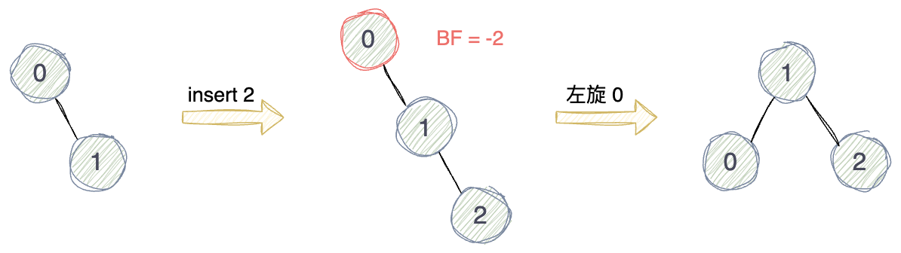

# Balanced Binary Search Tree / AVL Tree

## 概述

Balanced Binary Search Tree, 顾名思义，它即是二叉搜索树，也是平衡二叉树，所以必须同时满足二者的性质。即：

* 任意节点的左子树和右子树之间的高度差为-1,0或1；
* 任意节点的左子树中只包含小于当前节点值的值；
* 任意节点的右子树中只包含大于当前节点值的值；
* 任意节点的左右子树也必须分别是平衡二叉搜索树。

又称AVL树，这是为了纪念它的两位创始人G.M. Adelson-Velsky和E.M. Landis。

## 失衡与再平衡

`Balance Factor 平衡因子`

在AVL树中，一个节点的平衡因子定义为该节点的左子树的高度减去右子树的高度，即：BF(node) = node.left.height - node.right.height。

当树中某节点的平衡因子的绝对值大于1时，说明以该节点为根节点的子树失去了平衡，也就不再满足平衡二叉搜索树的定义。此时，需要通过`旋转`操作来使得子树重新达到平衡。

### 左旋 Left Rotation

如图所示，对一个节点进行左旋操作需要：

1. 逆时针旋转该节点和它的右孩子节点；
2. 原右孩子节点替代原父节点的位置；
3. 原右孩子节点的左孩子节点成为原父节点的右孩子节点；
4. 原父节点成为原右孩子节点的左孩子节点。

### 右旋 Right Rotation

如图所示，对一个节点进行右旋操作需要：

1. 顺时针旋转该节点和它的左孩子节点；
2. 原左孩子节点替代原父节点的位置；
3. 原左孩子节点的右孩子节点成为原父节点的左孩子节点;
4. 原父节点成为原左孩子节点的右孩子节点。

### 平衡旋转

#### LL

左左(LL)：在节点的左孩子节点的左子树中插入新节点而导致的失衡，需要对失衡节点进行`右旋`操作。

**Example 1:**

**Example 2:**

**Example 3:**

#### RR

右右(RR)：在节点的右孩子节点的右子树中插入新节点而导致的失衡，需要对失衡节点进行左旋操作。

**Example 1:**

**Example 2:**

**Example 3:**

#### LR

左右(LR)：在节点的左孩子节点的右子树中插入新节点而导致的失衡，需要先左旋失衡节点的左孩子节点，再右旋失衡节点。

**Example 1:**

**Example 2:**

**Example 3:**

#### RL

右左(RL)：在节点的右孩子节点的左子树中插入新节点而导致的失衡，需要先右旋失衡节点的右孩子节点，再左旋失衡节点。

**Example 1:**

**Example 2:**

**Example 3:**

`总结`

LL：单右旋

RR：单左旋

LR：先左旋再右旋

RL：先右旋再左旋

## 操作

Balanced Binary Search Tree本质上是一颗平衡的二叉搜索树，所以它的各种操作与二叉搜索树的类似，只需要额外增加平衡检查和失衡再平衡。

### 查找

* 如果当前节点为null，则返回false；
* 如果查找值等于当前节点值，则返回true；
* 如果查找值大于当前节点值，则在当前节点的右子树中继续查找；
* 如果查找值小于当前节点值，则在当前节点的左子树中继续查找。

### 插入

* 如果当前位置为空，则在当前位置插入新节点；
* 如果待插入值小于当前节点值，则在当前节点的左子树中继续寻找插入点；
    * 如果插入点在左孩子节点的左子树中，且造成当前节点失衡时，通过右旋失衡节点来调整；
    * 如果插入点在左孩子节点的右子树中，且造成当前节点失衡时，通过先左旋失衡节点的左孩子节点再右旋失衡节点来调整；
* 如果待插入值大于当前节点值，则在当前节点的右子树中继续寻找插入点；
    * 如果插入点在右孩子节点的右子树中，且造成当前节点失衡时，通过左旋失衡节点来调整；
    * 如果插入点在右孩子节点的左子树中，且造成当前节点失衡时，通过先右旋失衡节点的右孩子节点再左旋失衡节点来调整；
* 更新当前节点的高度。

### 删除

* 定位并删除指定的节点；
    * 如果待删除节点是叶子节点，直接删除父节点中的引用；
    * 如果待删除节点只有一个子节点，将父节点中的引用指向待删除节点的子节点；
    * 如果待删除节点有两个子节点，用左子树最大值节点或者右子树最小值节点来替换待删除节点；
* 更新当前节点的高度；
* 检查当前节点的平衡因子，如果需要，进行相应的平衡旋转。

## 复杂度

### 时间复杂度

查找：O(logn)

插入：O(logn)

删除：O(logn)

### 空间复杂度

# Refs

1. [AVL树 | 算法数据结构可视化](https://algo.hufeifei.cn/AVLtree.html)
2. [AVL Tree](https://www.programiz.com/dsa/avl-tree)
3. [AVL Tree Data Structure](https://www.geeksforgeeks.org/introduction-to-avl-tree/)
4. [Insertion in an AVL Tree](https://www.geeksforgeeks.org/insertion-in-an-avl-tree/)
5. [Deletion in an AVL Tree](https://www.geeksforgeeks.org/deletion-in-an-avl-tree/)