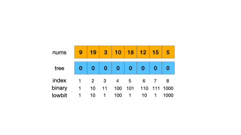
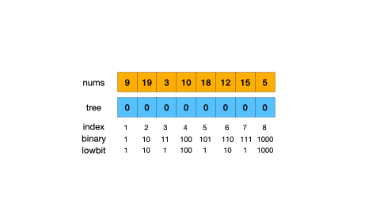

# Binary Indexed Tree / Fenwick Tree 二叉索引树/树状数组

## 概述

二叉索引树，由Peter M. Fenwick在1994年提出，又称Fenwick Tree或者树状数组。 最初是被设计用来解决数据压缩中的累加频率的计算问题，现在多用来高效查询数组的前缀和， 它可以在$O(\log_2 n)$时间内得到一个数组的任意前缀和。

## 设计原理

### `lowbit运算`

<strong>lowbit(n)</strong>的定义为非负整数n在二进制表示下最低位的1和其后所有的0所构成的二进制数的数值。

例如，lowbit(7) = lowbit((111)<sub>2</sub>) = (1)<sub>2</sub> = 1, lowbit(6) = lowbit((110)<sub>2</sub>) = (10)<sub>2</sub> = 2。

`lowbit计算公式：` lowbit(n) = n & (~n + 1) = n & (-n)

### `整数的二进制拆分`

一个非负整数n可以表示为一个或多个2的次方的和， 即 n = 2<sup>i<sub>1</sub></sup> + 2<sup>i<sub>2</sub></sup> + ... + 2<sup>i<sub>m</sub></sup>， 其中，i<sub>1</sub> ... i<sub>m</sub> 是n的二进制表示中从左到右依次为1的数位的下标值。

例如，7 = (111)<sub>2</sub> = 2<sup>2</sup> + 2<sup>1</sup> + 2<sup>0</sup>， 6 = (110)<sub>2</sub> = 2<sup>2</sup> + 2<sup>1</sup>。

根据非负整数n的二进制表示，可以将区间 [1, n] 拆分成$\log_2n$个不重叠且连续的子区间：[1, 2<sup>i<sub>1</sub></sup>]，[2<sup>i<sub>1</sub></sup> + 1, 2<sup>i<sub>1</sub></sup> + 2<sup>i<sub>2</sub></sup>]，... ...，[2<sup>i<sub>1</sub></sup> + 2<sup>i<sub>2</sub></sup> + ... + 2<sup>i<sub>m-1</sub></sup> + 1, n]。拆分得到的子区间的长度依次是：2<sup>i<sub>1</sub></sup>, 2<sup>i<sub>2</sub></sup>, ..., 2<sup>i<sub>m</sub></sup>。

例如，区间 [1, 7] 可以拆分成 [1, 4]，[5, 6]，[7, 7]。子区间长度依次是2<sup>2</sup>，2<sup>1</sup>，2<sup>0</sup>。

### `BIT的设计原理`

类比上述整数的二进制拆分，一个数组的前缀和也可以拆分成多个不重叠且连续的子区间和。其中，如何划分子区间是二叉索引树设计的关键。

虽然一个普通数组的元素值是没有特定规律的，但是却可以将整数的二进制拆分思想应用在数组(1-indexed)的下标值上，从而达到对数组进行区间划分的目的。

基于整数的二进制拆分思想，对于任意下标值i，如果以i为子区间右边界值，则子区间长度应为lowbit(i)，对应的子区间为[i-lowbit(i)+1, i]。因此，只要知道所有子区间的右边界值，便可得出拆分后的所有子区间。

`如何获得任意非负整数n进行二进制拆分后的所有子区间的右边界值？`

已知对于非负整数n，二进制拆分后得到的子区间的右边界值依次为：

* 2<sup>i<sub>1</sub></sup>
* 2<sup>i<sub>1</sub></sup> + 2<sup>i<sub>2</sub></sup>
* 2<sup>i<sub>1</sub></sup> + 2<sup>i<sub>2</sub></sup> + 2<sup>i<sub>3</sub></sup>
* ... ...
* 2<sup>i<sub>1</sub></sup> + 2<sup>i<sub>2</sub></sup> + 2<sup>i<sub>3</sub></sup> + ... + 2<sup>i<sub>m</sub></sup> （i.e. n）

可知，从左到右依次增加下一位为1的数位所对应的数值。给定非负整数n，我们可以依次减去lowbit(n)，即可得到从右到左的所有子区间的右边界值。代码如下：

```
while(n>0){
    System.out.println(n);
    n -= lowbit(n);
}
```

##### tree数组

定义树状数组***tree
***，长度为n+1，tree[i]表示原数组(1-indexed)在区间[i-lowbit(i)+1, i]中所有元素的和，即$tree[i] = \sum\limits_{k=i-lowbit(i)+1}^{i} nums[k]$。

例如：

* tree[1] = sum(nums[1, 1])
* tree[2] = sum(nums[1, 2])
* ...
* tree[6] = sum(nums[5, 6])
* tree[7] = sum(nums[7, 7])

##### presum函数

定义前缀和函数
***presum***，presum(n)返回原数组(1-indexed)在区间[1, n]中所有元素的和，即$presum(n) = \sum\limits_{k=1}^{n} nums[k]$。

利用tree数组，可以将presum(n)拆分成$O(\log_2 n)$个连续不重叠的子区间和的和，从而高效地计算出presum(n)，即：

presum(n) = tree[i<sub>1</sub>] + tree[i<sub>2</sub>] + ... + tree[i<sub>m</sub>]。其中，i<sub>1</sub>, i<sub>2</sub>, ... i<sub>m</sub>为n在进行二进制拆分后得到的所有子区间的右边界值。

例如：

* presum(7) = tree[4] + tree[6] + tree[7]
* presum(8) = tree[8]

## tree数组


上图演示了一个基于原整数数组构建得到的tree数组的树状结构。

### 节点关系

#### 父节点找子节点

找到一个节点的所有子节点。

例如：

* tree[8]的子节点为{tree[4], tree[6], tree[7]}
* tree[7]的子节点为{}
* tree[4]的子节点为{tree[2], tree[3]}

假设节点tree[x]是tree[i]的子节点，则满足x < i。根据定义，tree[i] = nums[i] + nums[i-1] + ... + nums[i-lowbit(i)+1]，而nums[i]不存在于tree[x]中，所以可以将nums[i]移除。因此问题转化为如何将nums[i-1] + .... + nums[i-lowbit(i)+1]拆分成一个或多个连续且不重叠的子区间和。

因为nums[i-1]只存在于tree[i-1]中，所以拆分结果中一定包含tree[i-1]，令x=i-1，可以得出一个子区间为[x-lowbit(x)+1, x]。现在问题转化为如何将nums[x-lowbit(x)] + ... + nums[i-lowbit(i)+1]拆分成一个或多个连续且不重叠的子区间和。

同理，nums[x-lowbit(x)]只存在于tree[x-lowbit(x)]中，所以拆分结果中一定包含tree[x-lowbit(x)]，令y=x-lowbit(x)，可以得出下一个子区间为[y-lowbit(y)+1, y]，即[x-lowbit(x)-lowbit(x-lowbit(x))+1, x-lowbit(x)]。问题进一步转化为如何将nums[y-lowbit(y)] + ... + nums[i-lowbit(i)+1]拆分成一个或多个连续且不重叠的子区间和。

依次类推，直到拆分到tree[i]覆盖范围的下边界值。

**综上所述**，给定节点tree[i]：

1. 令x = i-1；
2. 如果x>=i-lowbit(i)+1，则tree[x]为tree[i]的子节点，令x = x-lowbit(x)；
3. 重复步骤2，直到x<i-lowbit(i)+1。

代码如下：

```
public List<Integer> getChildren(int parent) {
  List<Integer> children = new ArrayList<>();
  int x = parent - 1, l = parent - lowbit(parent) + 1;
  while (x >= l) {
      children.add(x);
      x -= lowbit(x);
  }
  return children;
}
```

#### 子节点找父节点

找到一个节点的父节点。

例如：

* tree[1]的父节点为tree[2]
* tree[4]的父节点为tree[8]
* tree[5]的父节点为tree[6]
* tree[6]的父节点为tree[8]

假设节点tree[i]的父节点为tree[x]，可知i, x满足：

1. x > i
2. lowbit(x) > lowbit(i)
3. x-lowbit(x)+1 <= i-lowbit(i)+1

由2可知，lowbit(x) >= (10)<sub>2</sub>。所以x的二进制形式为XXXX10...0，x-1的二进制形式为XXXX01...1。因为tree[i]是tree[x]的子节点，可知i是由x-1持续移除最低位所得到的中间值，因此i的二进制形式为XXXX01...10...0或者XXXX01...11...1（i.e. x-1）。问题转化为求满足条件1、2、3的最接近i的x值。显而易见，只需要将i的最低位进一即为答案。

**综上所述**，给定节点tree[i]，其父节点为tree[i+lowbit(i)]。

代码如下：

```
public int getParent(int child) {
  return child + lowbit(child);
}
```

### 数组的构建

#### `构建思路一`

遍历原数组，对于每一个元素值，将其增加到树状数组中对应的起始节点及其所有的祖先节点中。时间复杂度为$O(n\log n)$。

*如何确定每个元素值对应的起始节点？*

nums[i]对应的起始节点为tree[i]，因为根据树状数组的定义，tree[1...i-1]都只覆盖nums[i]之前的元素值。

代码如下：

```
public BinaryIndexedTree(int[] nums) {
    int n = nums.length;
    tree = new int[n + 1];
    for (int i = 1; i <= n; i++) {
        add(i, nums[i - 1]);
    }
}

public void add(int i, int val) { // add val to tree[i] and its ancestors
    while (i < tree.length) {
        tree[i] += val;
        i += lowbit(i);
    }
}
```

示例演示：



#### `构建思路二`

与思路一类似，不同的是在将元素值增加到对应的起始节点后，不再需要向上遍历起始节点的所有祖先结点，取而代之的是将更新后的起始节点的值增加到起始节点的父节点中。时间复杂度为$O(n)$。

代码如下：

```
public BinaryIndexedTree(int[] nums) {
    int n = nums.length;
    tree = new int[n + 1];
    for (int i = 1; i < tree.length; i++) {
        tree[i] += nums[i - 1];
        if (i + lowbit(i) < tree.length) {
            tree[i + lowbit(i)] += tree[i];
        }
    }
}
```

示例演示：



## 操作

### 查询前缀和

求解数组的前n项和。只需要对n进行二进制拆分，返回拆分得到的子区间和的总和。

代码如下：

```
public int presum(int n) {
    int sum = 0, i = n;
    while (i > 0) {
        sum += tree[i];
        i -= lowbit(i);
    }
    return sum;
}
```

### 单点增加

将nums[i]增加val，更新树状数组。只需要将val增加到起始节点tree[i]和其所有的祖先节点中。

代码如下：

```
public void add(int i, int val) { // add val to tree[i] and its ancestors
    while (i < tree.length) {
        tree[i] += val;
        i += lowbit(i);
    }
}
```

## 复杂度

### 时间复杂度

查询前缀和：$O(\log n)$

单点增加：$O(\log n)$

### 空间复杂度

## 应用

### 逆序对

# Refs

1. [A New Data Structure for Cumulative Frequency Tables - Peter M. Fenwick](https://static.aminer.org/pdf/PDF/001/073/976/a_new_data_structure_for_cumulative_frequency_tables.pdf)
2. [算法和数据结构 | 树状数组（Binary Indexed Tree）](https://zhuanlan.zhihu.com/p/99167607)
3. [树状数组（BIT）—— 一篇就够了](https://www.cnblogs.com/Last--Whisper/p/13823614.html#bit-%E7%9A%84%E8%AF%A2%E9%97%AE%E6%9B%B4%E6%96%B0%E6%93%8D%E4%BD%9C%E5%8F%8A%E5%85%B6%E4%BB%A3%E7%A0%81%E5%AE%9E%E7%8E%B0)
4. [数据结构(1)——树状数组（原理与核心代码）](https://zhuanlan.zhihu.com/p/339780958)
5. [Fenwick Tree (Binary Indexed Tree) for Competitive Programming](https://www.geeksforgeeks.org/fenwick-tree-for-competitive-programming/)
