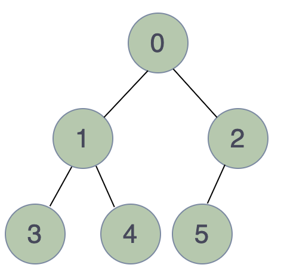
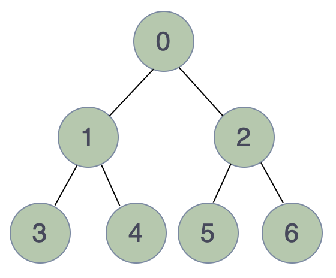
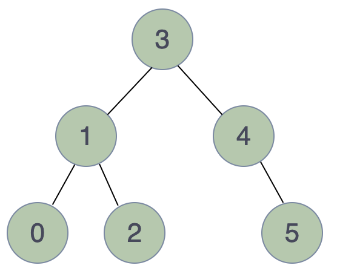
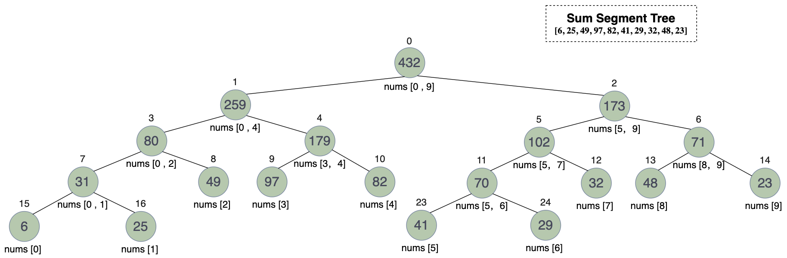

# Binary Tree 二叉树

## 概述

二叉树是一种树状数据结构，每个节点至多有两个子节点。

## 性质

* 树的第l层至多有2l个节点，根节点所在的层数为0；
* 高度为h的二叉树至多有2h-1个节点，根节点高度为1；
* 节点数为n的二叉树的最小层数和高度为$\log_{2}{n+1}$；
* 叶子节点数为m的二叉树层数至少为$\lvert \log_{2}{m} \rvert$；

## 操作

### 插入

* 如果树中没有节点，则将新节点插入到树根处；
* 如果遇到缺失左孩子节点的节点，则将新节点插入到该节点的左孩子处；
* 如果遇到缺失右孩子节点的节点，则将新节点插入到该节点的右孩子处。

### 遍历

二叉树是树的一种，所以它的遍历与树的遍历思路相同，不同的是二叉树的遍历只需要考虑每个节点至多两个子节点。

#### 深度优先 Depth First

##### Preorder Traversal 先序遍历

先访问根节点，再访问左孩子节点，最后访问右孩子节点。

##### Inorder Traversal 中序遍历

先访问左孩子节点，再访问根节点，最后访问右孩子节点。

##### Postorder Traversal 后序遍历

先访问左孩子节点，再访问右孩子节点，最后访问根节点。

#### 广度优先 Breadth First

自上而下一层一层自左向右访问每个节点。

### 删除

* 找到要删除的节点和树中最后一层最右侧的节点；
* 用最后一层最右侧的节点的数据替换要删除的节点的数据；
* 删除最后一层最右侧的节点。

### 搜索

* 如果当前节点为null，返回false；
* 如果当前节点的数据等于要查找的数据，返回true；
* 如果当前节点的数据不等于要查找的数据，则继续搜索当前节点的左子树和右子树。

## Types of Binary Tree

### Degenerate/Pathological Tree

Every non-leaf node has only one child.

`Examples`

### Skewed Binary Tree

`Left-Skewed Binary Tree`

Every non-leaf node only has the left child.

`Right-Skewed Binary Tree`

Every non-leaf node only has the right child.

`Examples`

### Full Binary Tree

Every node has either 0 or 2 children. We can also say every non-leaf node has 2 children.

`Examples`

### Complete Binary Tree 完全二叉树

All the levels except the last level must be completely filled and all nodes of last level must be left-justified.

`Examples`

### Perfect Binary Tree 完美二叉树

Every level is completely filled.

`Properties`

1. The number of leaf nodes is the number of internal nodes plus one.
2. The number of nodes is 2h+1-1, where h is the height of the tree.

`Examples`

### Balanced Binary Tree

The difference between the height of the left and right subtree for each node is -1, 0 or 1.

`Propertites`

1. The height of the tree is $\lfloor \log_2n \rfloor$, where n is the number of nodes.

`Examples`

### [Binary Search Tree 二叉搜索树](binary/binarySearchTree/binary_search_tree.md)

For every node in the tree:

* Its left subtree only contains the nodes with smaller values.
* Its right subtree only contains the nodes with greater values.
* Both left and right subtree must also be a binary search tree.

### [Balanced Binary Search Tree / AVL Tree](avlTree/avl_tree.md)

A Balanced Binary Search Tree is a binary search tree as well as a balanced binary tree, which means:

* The difference between the height of the left and right subtree for each node is -1, 0 or 1.
* Each subtree is a binary search tree.

Thus, each subtree of a balanced binary search tree is also a balanced binary search tree.

### [Segment Tree](segmentTree/segment_tree.md)

Segment tree is a binary tree that each node stores the information of an interval for a set. It provides efficient methods to handle interval updates and queries.

# Refs & Readings

1. [Introduction to Binary Tree](https://www.geeksforgeeks.org/introduction-to-binary-tree/)
2. [Types of Binary Tree](https://www.geeksforgeeks.org/types-of-binary-tree/)
3. [Properties of Binary Tree](https://www.geeksforgeeks.org/properties-of-binary-tree/)
4. [几道和「二叉树」有关的算法面试题](https://cloud.tencent.com/developer/article/1408755)