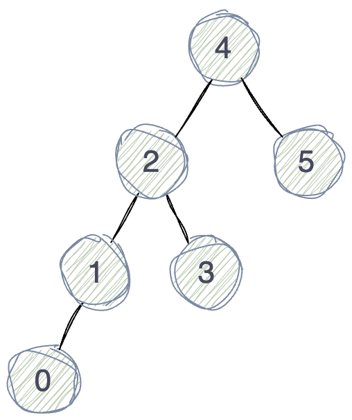

# Binary Search Tree 二叉搜索树

## 概述

二叉搜索树是指空树或者满足以下性质的二叉树：

* 对于任意节点，如果左子树不为空，则左子树只包含小于当前节点值的值；
* 对于任意节点，如果右子树不为空，则右子树只包含大于当前节点值的值；
* 对于任意节点，它的左右子树也都是二叉搜索树。

## 操作

### 查找

* 如果当前节点为null，则返回false；
* 如果查找值等于当前节点值，则返回true；
* 如果查找值大于当前节点值，则在当前节点的右子树中继续查找；
* 如果查找值小于当前节点值，则在当前节点的左子树中继续查找。

### 插入

* 如果当前位置为空，则在当前位置插入新节点；
* 如果待插入值大于当前节点值，则在当前节点的右子树中继续寻找插入点；
* 如果待插入值小于当前节点值，则在当前节点的左子树中继续寻找插入点。

### 删除

* 待删除节点是叶子节点
    * 直接删除父节点中的引用
* 待删除节点只有一个子节点
    * 将父节点中的引用指向待删除节点的子节点
* 待删除节点有两个子节点
    * 用左子树最大值节点或者右子树最小值节点来替换待删除节点

## 复杂度

### 时间复杂度

查找：O(logn)

插入：O(logn)

### 空间复杂度

# Refs

1. [二分搜索树的原理和实现](https://www.cnblogs.com/hello-shf/p/11342907.html)