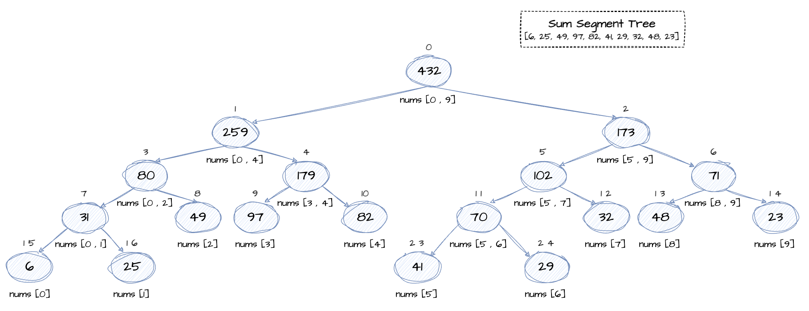

# Segment Tree 线段树

## 概述

Segment Tree 是一种二叉树数据结构，每一个节点存储对应数组区间的信息。父节点是两个子节点信息的融合。它可以提供高效的区间查询和更新，适用于求区间和、区间最小最大等区间相关的问题。

对于节点i，左子节点坐标为2*i+1，右子节点坐标为2*i+2，父节点坐标为(i-1)/2。

## 操作

### 区间查询

查询给定区间[l, r]的信息，i.e. 元素和、最大最小元素、异或值等。

### 局部更新

将原数组下标i处的数值更新为给定的数值val，更新线段树中对应区间的信息。

## 复杂度

### 时间复杂度

update: O(logn)

query: O(logn)

### 空间复杂度

# Refs

1. [Segment Tree](https://www.geeksforgeeks.org/segment-tree-data-structure/)
2. [Segment Tree | Sum of given range](https://www.geeksforgeeks.org/segment-tree-sum-of-given-range/)