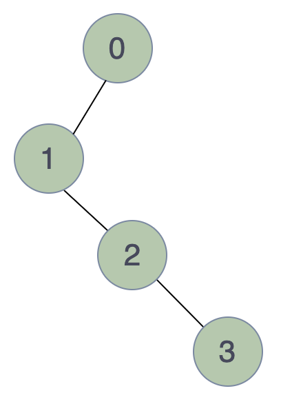
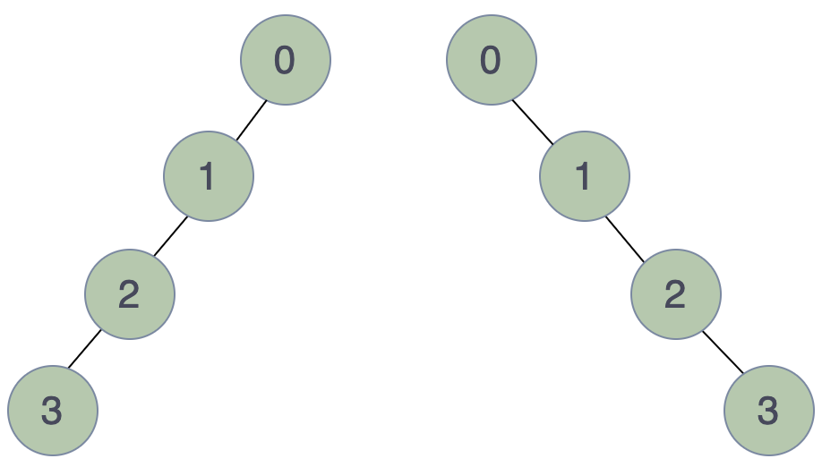
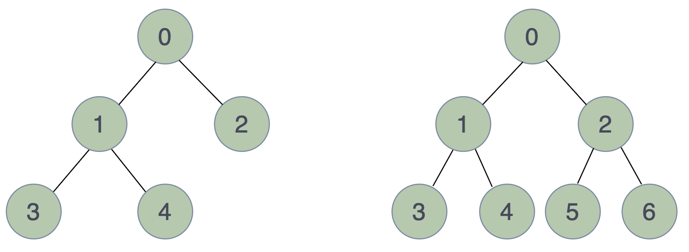
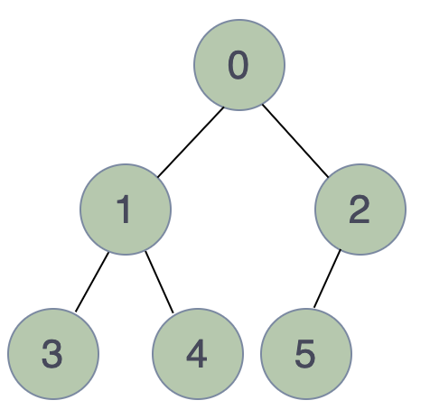
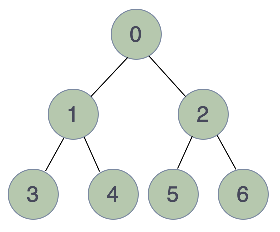
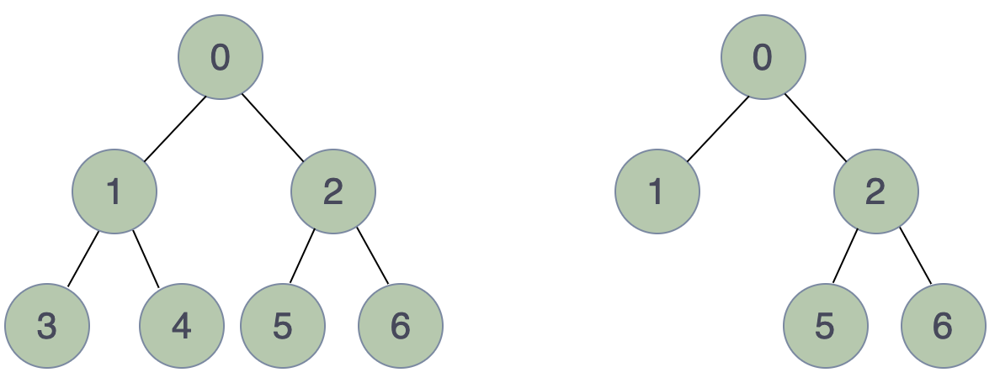
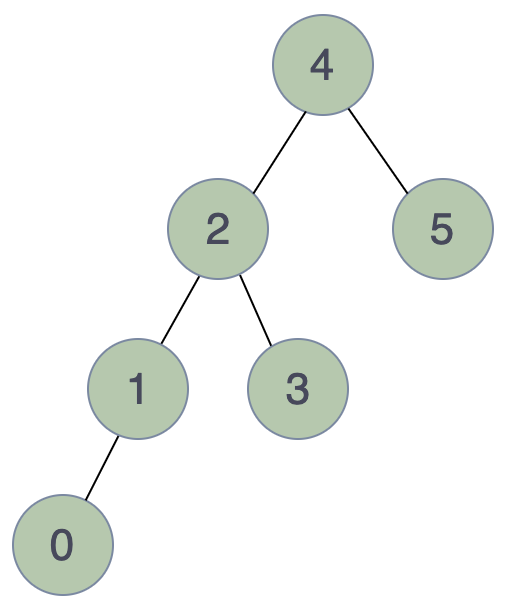
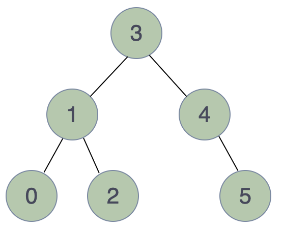

# Tree 树

1. 节点 Node
    1. 根节点 Root Node
    2. 叶子节点 Leaf Node
    3. 子节点 Child
    4. 父节点 Parent
    5. 兄弟节点 Sibling
2. 边 Edge
3. 路径 Path
4. 层数 Level
5. 高度 Height
6. 深度 Depth
7. 子树 Subtree

## Binary Tree 二叉树

### Degenerate/Pathological Tree

Every non-leaf node has only one child.

`Examples`

### Skewed Binary Tree

`Left-Skewed Binary Tree`

Every non-leaf node only has the left child.

`Right-Skewed Binary Tree`

Every non-leaf node only has the right child.

`Examples`

### Full Binary Tree

Every node has either 0 or 2 children. We can also say every non-leaf node has 2 children.

`Examples`

### Complete Binary Tree 完全二叉树

All the levels except the last level must be completely filled and all nodes of last level must be left-justified.

`Examples`

### Perfect Binary Tree 完美二叉树

Every level is completely filled.

`Properties`

1. The number of leaf nodes is the number of internal nodes plus one.
2. The number of nodes is 2h+1-1, where h is the height of the tree.

`Examples`

### Balanced Binary Tree

The difference between the height of the left and right subtree for each node is either 0 or 1.

`Propertites`

1. The height of the tree is $\lfloor \log_2n \rfloor$, where n is the number of nodes.

`Examples`

### Binary Search Tree 二叉搜索树

For every node in the tree:

* Its left subtree only contains the nodes with smaller values.
* Its right subtree only contains the nodes with greater values.
* Both left and right subtree must also be a binary search tree.

### Balanced Binary Search Tree / AVL Tree

A Balanced Binary Search Tree is a binary search tree as well as a balanced binary tree, which means:

* The difference between the height of the left and right subtree for each node is either 0 or 1.
* Each subtree is a binary search tree.

Thus, each subtree of a balanced binary search tree is also a balanced binary search tree.

# Refs & Readings

1. [Types of Binary Tree](https://www.geeksforgeeks.org/types-of-binary-tree/)