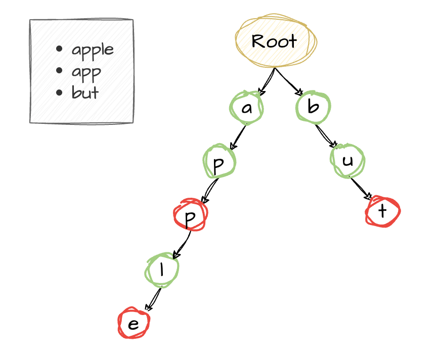
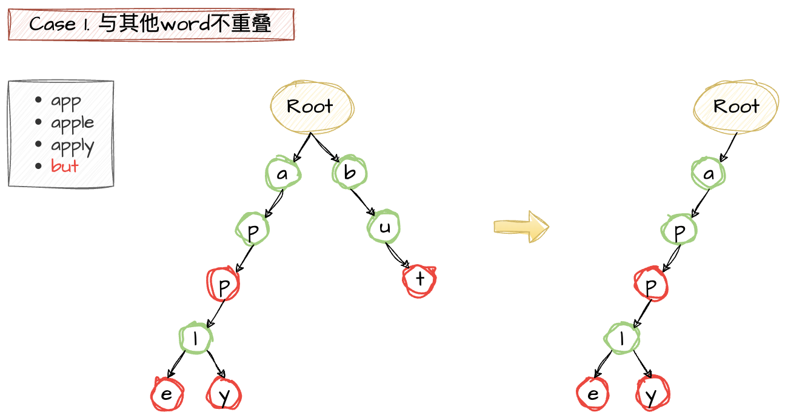
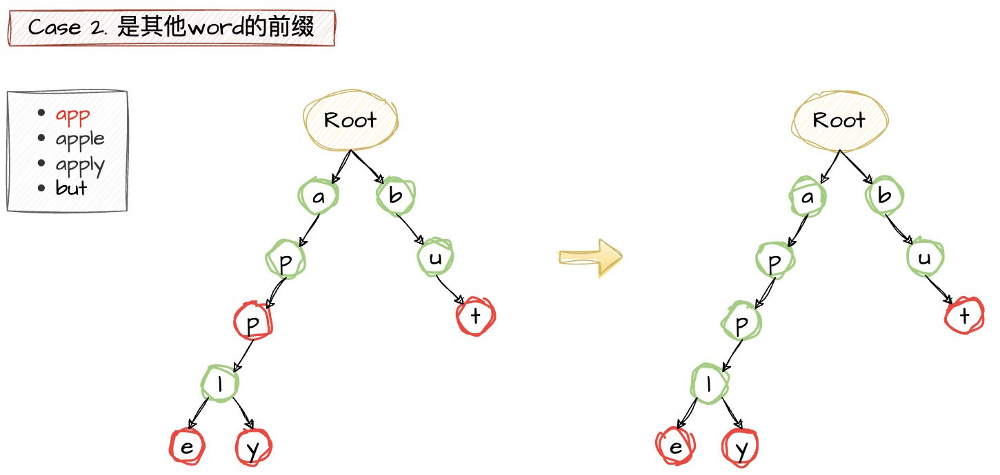
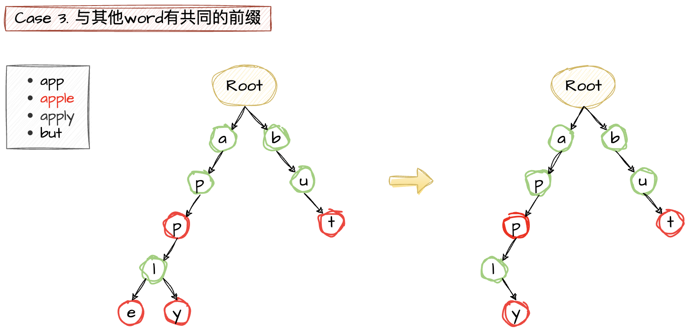

# Trie 字典树

## 概述

Trie是一种树状结构，可以提高搜索效率，并且可以支持前缀搜索。

## 操作

### 插入

### 删除

1. 与其他word不重叠，删除掉所有的node；
2. 是其他word的前缀，将最后一个node的isEnd设为false；
3. 与其他word有共同的前缀，删除掉除共同前缀外的所有node。

### 搜索

## 复杂度

### 时间复杂度

#### Search

O(L) - L为要搜索的字符串的长度

## 扩展

# Refs

1. [Introduction to Trie – Data Structure and Algorithm Tutorials](https://www.geeksforgeeks.org/introduction-to-trie-data-structure-and-algorithm-tutorials/)
2. [Trie | (Insert and Search)](https://www.geeksforgeeks.org/trie-insert-and-search/)
3. [Trie | (Delete)](https://www.geeksforgeeks.org/trie-delete/)
4. [Advantages of Trie Data Structure](https://www.geeksforgeeks.org/advantages-trie-data-structure/)