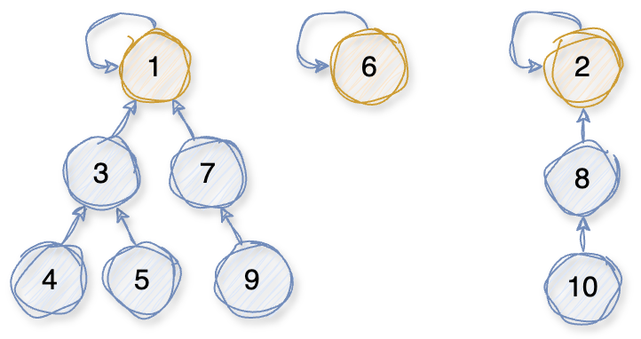
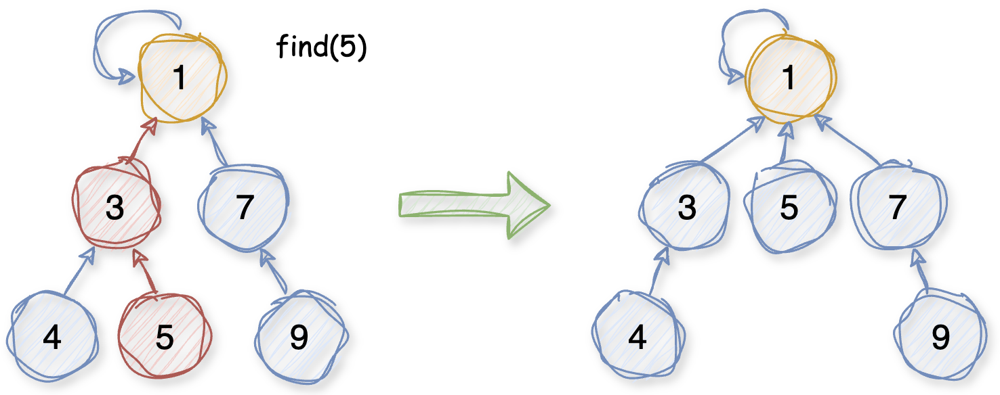
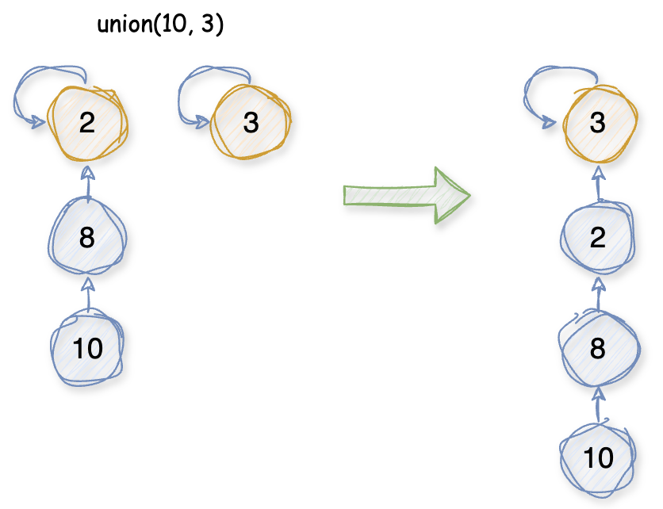
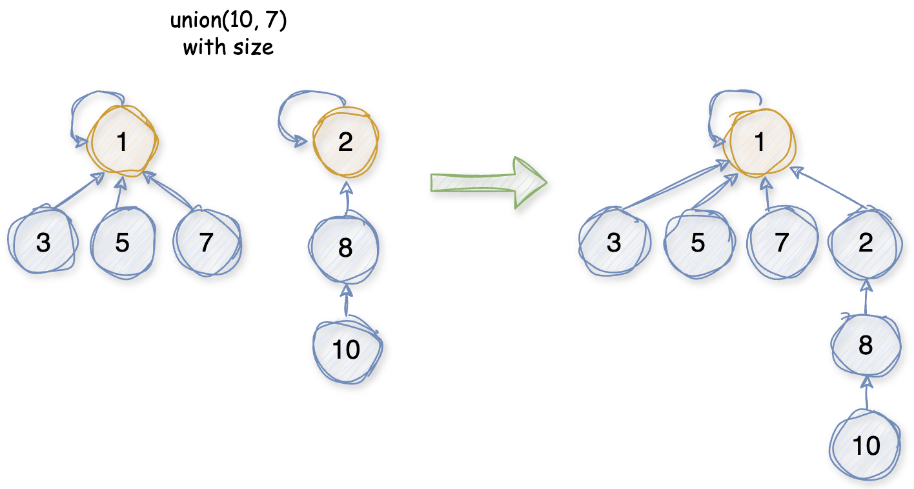

# Union Find 并查集

## 概述

并查集是一种树型的数据结构，用来解决多个不相交集合的合并和查询问题。

基本设计思想是用一个数组来表示一片森林，其中同一颗树中的所有元素属于同一个集合，树的根节点用来唯一标识该集合。通过查询元素所在树的根节点可以判断该元素所在集合以及判断两个元素是否属于同一集合。

## 操作

### Find 查找

找到给定元素所在的集合：

* 从给定节点出发，不断向上查询父节点，直到找到根节点。

`路径压缩`

将查找过程中经过的所有节点都直接指向最终查找到的根节点，以提高后续查找的效率。

### Union 合并

合并两个给定元素所在的集合：

* 找到两个元素所在集合的根节点；
* 将一个根节点指向另一个根节点。

#### 效率优化

在合并两个集合时，如果不对两个根节点的连接操作进行优化，则可能出现下图中的情况，导致后续的查找操作效率退化。

`size优化`

用size数组记录元素所在集合的元素个数。当合并两个集合时，将元素较少的集合的根节点指向元素较多的集合的根节点，并更新根节点的size。

这种优化方法在一定程度上可以避免合并操作导致的查询效率的退化，但是在遇到下图中的情况时仍然无法避免。

`rank优化`

用rank数组记录元素所在集合的树的高度。当合并两个集合时，将高度较小的集合的根节点指向高度较大的集合的根节点，并更新根节点的rank。

## 复杂度

### 时间复杂度

h为树的高度

find：O(h)

union：O(h)

`With rank:`

find：O(logn)

union：O(logn)

### 空间复杂度

O(n)

# Refs

1. [并查集](https://www.runoob.com/data-structures/union-find-basic.html)