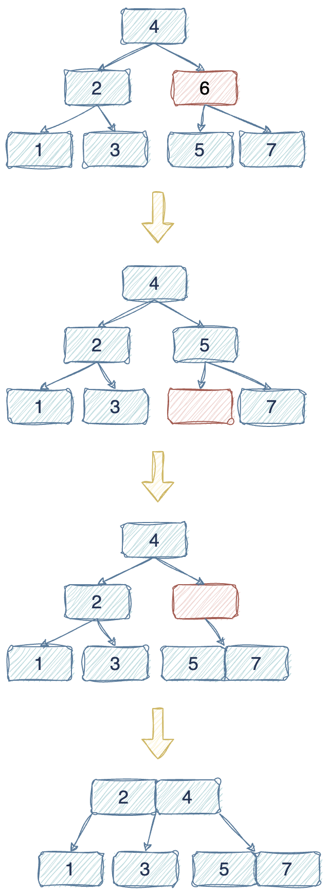

# 2-3 Tree

## 2-3树的性质

1. 2-3树是平衡树。

2. 2-3树中的数据从左至右依次递增。

3. 2-3树中的插入发生在叶子节点，插入后再进行分裂或融合以保证树的平衡。

4. 2-3树中的节点有以下三种：

    * 2节点：一个数据项，有两个子节点；
    * 3节点：两个数据项，有三个子节点；
    * 叶子节点，可以有一个或者两个数据项，没有子节点。

## 2-3树的操作

### 插入 Insert

#### Case 1. 插入到只有一个数据项的叶子节点

#### Case 2 插入到有两个数据项的叶子节点，且其父节点是2节点

#### Case 3 插入到有两个数据项的叶子节点，且其父节点是3节点

#### 时间复杂度

O(log N)

### 搜索 Search

Search key K in a 2-3 tree T.

`Base cases:`

1. T is empty, return False;
2. Current node contains value K, return True;
3. Current node is leaf node and not contains value K, return False.

`Recursive calls:`

1. K < current node's left value, search in the left subtree;
2. current node's left value < K < current node's right value, search in the middle subtree;
3. K > current node's right value, search in the right subtree.

#### 时间复杂度

O(log N)

### 删除 Delete

#### Case 1. 删除叶子节点

* 1.1 节点为3节点(2个数据项)：直接删除
  

* 1.2 节点为2节点(1个数据项)，分情况讨论
    * 1.2.1 父节点为2节点，兄弟节点为3节点：旋转
      

    * 1.2.2 父节点为2节点，兄弟节点为2节点 - 满二叉树
        1. 删除叶子节点；
        2. 父节点下沉，与兄弟节点合并；
        3. 父节点的父节点下沉，与父节点的兄弟节点合并；
        4. ... ... continue until root node;
        5. 最终，删除后得到的2-3树层数比删除前的层数减一。

      `Example 1`
      

      `Example 2`
      

    * 1.2.3 父节点为2节点，兄弟节点为2节点 - 非满二叉树
        1. 删除叶子节点；
        2. 父节点下沉，与兄弟节点合并；
        3. 之后分情况讨论：
            * 父节点的兄弟节点为3节点：旋转

              `Example 1`
              

              `Example 2`
              

            * 父节点的兄弟节点为2节点
                * 父节点的父节点为3节点：父节点的父节点下沉，与父节点的兄弟节点合并

                  

                * 父节点的父节点为2节点：
                    1. 父节点的父节点下沉，与父节点的兄弟节点合并;
                    2. 继续向上删除父节点的父节点，直到无需再向上删除为止。

                  `Example 1`
                  

                  `Example 2`
                  

                  `Example 3`
                  

                  `Example 4`
                  

    * 1.2.4 父节点为3节点，兄弟节点为2节点：父节点下沉，与兄弟节点合并
      

    * 1.2.5 父节点为3节点，兄弟节点为3节点：父节点下沉，兄弟节点中最近值上升
      

#### Case 2. 删除非叶子节点

1. 将待删除节点与中序遍历中的直接前驱结点交换；
2. 转换成叶子结点的删除操作。

* 2.1 节点为3节点(2个数据项)

`Example 1`

`Exmaple 2`

`Example 3`

* 2.2 节点为2节点(1个数据项)

`Example 1 - 满二叉树`

`Example 2 - 父2兄3子2`

`Example 3 - 父2兄2子2`

`Example 4 - 父3兄2子2`

`Example 5 - 父3兄3子2`

`Example 6 - 左子3`

`Example 7 - 右子3`

#### 时间复杂度

O(log N)

# Refs

1. [2-3 Trees | (Search, Insert and Deletion)](https://www.geeksforgeeks.org/2-3-trees-search-and-insert/)
2. [B-Tree Visualization](https://www.cs.usfca.edu/~galles/visualization/BTree.html)